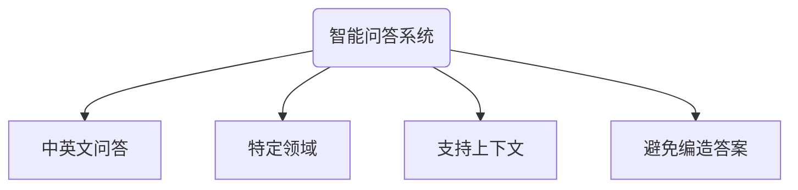
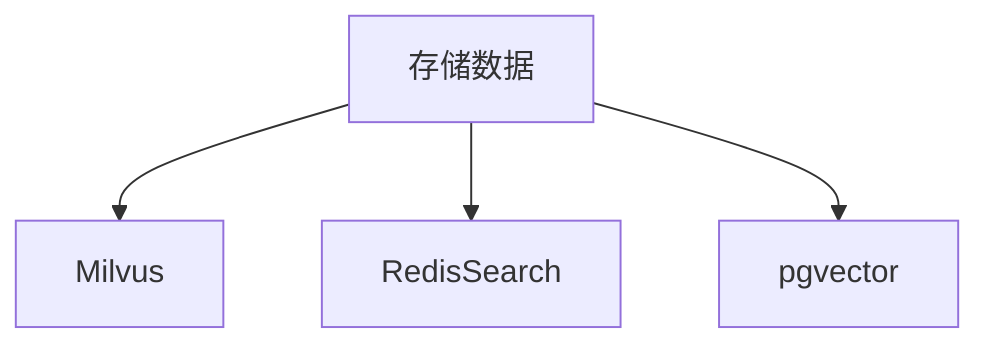
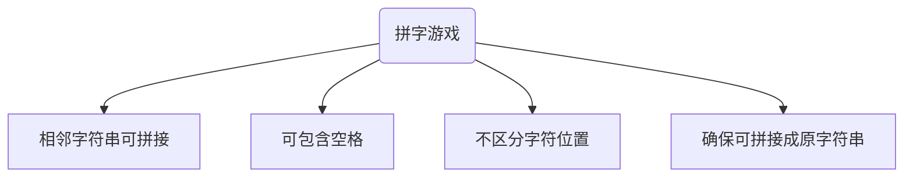

# 实习-ChatGPT


[toc]

# 一、智能问答系统

> **背景**：
>
> 传统站内搜索系统基于关键字匹配，在面向：特定领域知识库、技术图谱、产品说明、企业/学校生活指南等业务场景时，缺少对用户问题理解和答案二次处理能力。
>
> 大语言模型（Large Language Model, LLM）通过其对自然语言理解和生成的能力，可以猜测用户意图，并对原始知识点进行提炼、汇总、整合，进而生成更贴切的答案。
>
> 现有的大语言模型如 ChatGPT， 知识库仅覆盖至 2021 年 9 月前的信息，无法参考训练数据集未包含的信息及之后出现的新信息。
>
> 本文探索通过 LLM，打造 **特定领域知识（Domain-specific Knowledge）问答**系统:robot:。

## 1.1 需求分析

在 Web 端，实现一个可以**在特定领域与用户对话的智能问答系统:robot:**。具体需求分析如下：



- 通过**问答的形式**，和用户交互，同时支持中文和英文；
- 问题的回答需要**参考站内提供的特定领域的原始信息**；
- **支持上下文**。用户的问题可能与历史会话相关，需要从历史回答提取上下文；
- **回答准确**。ChatGPT 很擅长在不擅长的领域“表现”的很擅长，要尽量避免这种情况！

由于 LLM 无法参考预训练数据集之外的数据，因此实现上述需求的关键就在于：**如何向 LLM 反馈特定领域的知识库**。

## 1.2 方案分析

通过调研，业界主流的方案有两种。

###  **Fine-Tunning**:moneybag::+1:

**`Fine-Tunning`**：对开源的 LLM 进行全面或部分的微调，采用 fine-tune 或者 LoRA 技术。业界已经不少 chatgpt 的平替方案都支持**微调**，比如：

- 清华大学于 2023.03 提出的 **ChatGLM** 支持中英双语，具有 62 亿参数，可以在消费级显卡上部署，INT4 量化级别下最低只需要 6GB 显存。

- **Alpaca** 是在 Meta 提出的 LLaMA 7B 模型基础上微调的结果。原生的 Alpaca 对中文的支持并不好，不过已经业界也做了些**扩充中文词表的开源方案**。

**优点**：

- 能使 LLM **“彻底记住”特定的领域知识**，从而在拥有特定知识背景的条件下进交流；
- 采用**私有部署**，适合用于一些尚未公开的公司内部知识，不会造成信息泄露。

**缺点**：

- **资源消耗非常大**。消耗的资源量虽然相对大模型预训练减少，但还是不容小觑的。比如 Alpaca 的微调，据作者介绍他们使用 8 个 显存 80GB A100 ，花费了 3 个小时。如果领域支持频繁更新，且需要需要较高的实时性，显然是无法满足要求的。
- **需要构建特定预训练语料库**。高质量训练数据集的构建需要精心设计，开销也是不容忽视的。
- **微调的结果不一定符合预期**。

### Embedding:star:

**`Embedding`**：通过嵌入模型，将特定知识转化为向量 `Embedding`，然后将这些向量存入相应的向量数据库中。在查询阶段，通过相似度查询，匹配出关联的 `topK` 结果，然后将这些结果提供给 LLM，生成相应的答案。

**优点**：

- 成本低；
- 优秀的正确度和精确度；

**缺点**：

- 可能存在数据泄露的风险；
- 可嵌入的文本有长度限制，可能会有丢失部分上下文的风险。

|     **Model**     | **Maximum text length** |
| :---------------: | :---------------------: |
| **gpt-3.5-turbo** |     4,096(~5 pages)     |
|     **gpt-4**     |    8,192(~10 pages)     |
|   **gpt-4-32k**   |    32,768(~40 pages)    |

> **参考链接**：
>
> - [Question answering using embeddings-based search](https://github.com/openai/openai-cookbook/blob/main/examples/Question_answering_using_embeddings.ipynb?spm=wolai.workspace.0.0.357e11a2XSQ9wO&file=Question_answering_using_embeddings.ipynb)

## 1.3 整体流程


1. 准备领域知识库（每个文档需要一次）
   - **收集文本信息**：通过指定数据源获取原始文本信息；

   - **分块（Chunk）**：根据 `Token` 限制，将长文本拆分成短文本；

   - **嵌入（Embedding）**：通过 OpenAI API 获取每块文本的嵌入信息 `Embedding`；

   - **存储**：将 `Embedding` 保存在向量数据库，推荐使用`Milvus`。

2. 搜索（每次查询需要一次）

   - 给定一个用户查询请求，通过 OpenAI API 生成该问题对应的 `Embedding`；

   - 从向量数据库中查询与该问题对应 `Embedding` 最相似的 `TopN` 个文本，并按照相似度排序；

3. 询问（每次查询需要一次）

   - 将前置背景信息、历史问答、查询问题、相似文本插入到一个 `Complection` 发送给 ChatGPT；

   - 返回 `ChatGPT` 的回答并进行处理。

## 1.4 关键实现

以下功能均通过 Go 实现。

### 准备知识库


#### 获取原始信息

这里的文本来源主要是：https://trlab.com/

可以通过 Go 的爬虫框架 Colly 写一个简易的脚本，爬取**文章**和 **FAQS**。此处直接从接口获取：
```go
func CrawArticles(url string, object any) {
	c := colly.NewCollector()
	c.OnRequest(func(r *colly.Request) {
		fmt.Println("Visiting", r.URL)
	})
	c.OnResponse(func(response *colly.Response) {
		if err := json.Unmarshal(response.Body, object); err != nil {
			logger.ZapLogger.Error(err.Error())
			return
		}
	})
	c.Visit(url)
}
```

`CrawArticles()` 参数为一个接口地址 `url` 和接收对象 `object`，会将获取的信息按照 `object` 格式进行解析。

#### Tokenizer

**`Token`**：LLM 理解语言的基本单元，通过将文本分解为 Token 来理解和处理文本。单词和 Token 不是一一对应的，比如 `goodness` 就由`good`、`ness` 两个 Token 组成。中文通常先转换为 Unicode 或 UTF-8 编码，再转换成 Token。

**`Tokenizer`**：分词器，将文本分成一个个词元，保证各个词元拥有相对完整和独立的语义，以供后续任务比如 `Embedding` 使用。此处选用`Tiktoken`，有多种编码方法可选，如：`r50k_base`，`p50k_base`，`cl100k_base` 等。面向 OpenAI 的 `gpt-4`，`gpt-3.5-turbo` 和 `text-embedding-ada-002` 模型通常使用 `cl100k_base` 编码方法。

了解文本中的 Token 数量，既可以告诉你字符串是否太长而超出了模型处理能力，也可以查看 OpenAI 的 API 费用（按照token计费）。

OpenAI 官方提供了一个在线[分词工具](https://platform.openai.com/tokenizer)，根据工具提供的分词结果看，**1 个中文词语会分解为 2/3 个 Token**。


OpenAI 按照 `token` 数目收费，并且每个 `embedding-model` 和 `gpt-model` 对 `token` 数目都有限制，超出部分会被截断。注意：长度是指通过 `Tokenizer` 计算出的 `token`长度，而非文本字符串的长度。

比如 `text-embedding-ada-002`  采用的  `cl100k_base` 的 `max token` 为 8191，而 `gpt-3.5-turbo` 单次询问的 `max token` 为 4096。

|     EMBEDDING MODEL      |   TOKENIZER   | MAX INPUT TOKENS | OUTPUT DIMENSIONS |
| :----------------------: | :-----------: | :--------------: | :---------------: |
| `text-embedding-ada-002` | `cl100k_base` |       8191       |       1536        |

| GPT MODEL           | MAX TOKENS                 |
| ------------------- | -------------------------- |
| `gpt-3.5-turbo`     | 4,096 tokens (~5 pages)    |
| `gpt-3.5-turbo-16k` | 16,384 tokens（~20 pages） |
| `gpt-4`             | 8,192 tokens (~10 pages)   |
| `gpt-4-32k`         | 32,768 tokens (~40 pages)  |

官方文档提供了 Python 计算 `Token` 的方法，此处提供 Go 的版本：

```go
// CountMessagesTokens based on "How_to_count_tokens_with_tiktoken.ipynb"
func CountMessagesTokens(model string, messages ...openai.ChatCompletionMessage) (numTokens int) {
	tkm, err := tiktoken.EncodingForModel(model)
	if err != nil {
		err = fmt.Errorf("encoding for model: %v", err)
		log.Println(err)
		return
	}

	var tokensPerMessage, tokensPerName int
	switch model {
	case "gpt-3.5-turbo-0613",
		"gpt-3.5-turbo-16k-0613",
		"gpt-4-0314",
		"gpt-4-32k-0314",
		"gpt-4-0613",
		"gpt-4-32k-0613":
		tokensPerMessage = 3
		tokensPerName = 1
	case "gpt-3.5-turbo-0301":
		tokensPerMessage = 4 // every message follows <|start|>{role/name}\n{content}<|end|>\n
		tokensPerName = -1   // if there's a name, the role is omitted
	default:
		if strings.Contains(model, "gpt-3.5-turbo") {
			//logger.ZapLogger.Warn("warning: gpt-3.5-turbo may update over time. Returning num tokens assuming gpt-3.5-turbo-0613.")
			return CountMessagesTokens("gpt-3.5-turbo-0613", messages...)
		} else if strings.Contains(model, "gpt-4") {
			//logger.ZapLogger.Warn("warning: gpt-4 may update over time. Returning num tokens assuming gpt-4-0613.")
			return CountMessagesTokens("gpt-4-0613", messages...)
		} else {
			err = fmt.Errorf("num_tokens_from_messages() is not implemented for model %s. See https://github.com/openai/openai-python/blob/main/chatml.md for information on how messages are converted to tokens.", model)
			logger.ZapLogger.Error(err.Error())
			return
		}
	}

	for _, message := range messages {
		numTokens += tokensPerMessage
		numTokens += len(tkm.Encode(message.Content, nil, nil))
		numTokens += len(tkm.Encode(message.Role, nil, nil))
		numTokens += len(tkm.Encode(message.Name, nil, nil))
		if message.Name != "" {
			numTokens += tokensPerName
		}
	}
	numTokens += 3 // every reply is primed with <|start|>assistant<|message|>
	return numTokens
}
```

#### 安全分片

**安全分片**：将原始知识库拆分为若干个独立、较短的知识点:star:每个知识点会作为问答的最小记录，与问题进行匹配。

分片时有如下可参考的原则：

- 原始内容在编写、组织时最好原子化、正交化。对于树状结构的知识点，可以按层级关系表示，最好不要混为一谈。比如倚天剑可能基础属性，也有适合的打法，偏向的英雄天赋，那么三者应该独立描述，而不要混杂在一起；
- 可以在原始语料中设计明确的分片标记，简化处理过程；
- 基本的分片方式，粒度从细到粗可以使用：标点符号、段落、章节等。分片粒度过细，知识点会比较零碎影响了相互间的关系；分片粒度过粗，在匹配时可能会携带冗余信息，另外对 `Embedding`、处理、索引的效率也有影响。
- 分片要使用 `Tokenizer`，原始文本经过分词然后再进行 `Embedding`，分片大小需要考虑分词之后生成的 `Token` 数量。基本目标是：分片不能破坏知识点的完整性，生成的分片对应的 `Token` 数量应该在预设范围内，不要过小或过大。

此处按照限制的 `Token` 最大长度，切割 `string` 类型的文本信息：

```go
// ChunkedTokens encodes a string into tokens and then breaks it up into chunks
func ChunkedTokens(text string, model string, chunkLength int) [][]int {
	if chunkLength < 1 {
		logger.ZapLogger.Error("chunkLength must be at least one")
		return nil
	}

	return Batched(GetToken(text, model), chunkLength)
}

// Batched batch data into slices of length n. The last batch may be shorter.
func Batched(data []int, n int) [][]int {
	var batches [][]int

	for len(data) > 0 {
		if len(data) < n {
			n = len(data)
		}

		batch := make([]int, n)
		copy(batch, data[:n])
		batches = append(batches, batch)
		data = data[n:]
	}
	return batches
}
```

由于 Go-SDK 很不完善，目前没有从 `Token` 构造 OpenAI 请求的方法，因此需要记录每个 `Token` 对应的文本信息，也就是需要实现从 `Token` 重新解析为 `string` 类型的文本信息：

```go 
func GetToken(text string, model string) []int {
	enc := RegisterEncoder(model)
	return enc.Encode(text, nil, nil)
}

func ParseToken(token []int, model string) string {
	enc := RegisterEncoder(model)
	return enc.Decode(token)
}
```

最终获得安全分片函数：

```go
// SafeGetChunks safely handles embedding requests, even when the input text is longer than the maximum context length.
func SafeGetChunks(textBot *openai.Client, model openai.EmbeddingModel, text string, average bool, maxToken int) []*chatgpt.Chunk {
	var chunks []*chatgpt.Chunk
	var chunkLens []int
	var totalLen int

	for _, chunk := range ChunkedTokens(text, model.String(), maxToken) {
		t := ParseToken(chunk, model.String())
		chunks = append(chunks, &chatgpt.Chunk{
			Embedding: GetEmbedding(textBot, model, t),
			Content:   t,
		})
		chunkLens = append(chunkLens, len(chunk))
		totalLen += len(chunk)
	}

	// return the weighted average of the chunk embeddings
	if average {
		sum := make([]float64, len(chunks[0].Embedding))
		for i, chunk := range chunks {
			for j, val := range chunk.Embedding {
				sum[j] += float64(val) * float64(chunkLens[i])
			}
		}
		for i := 0; i < len(sum); i++ {
			sum[i] /= float64(totalLen)
		}
		return []*chatgpt.Chunk{{Embedding: NormalizeVector(sum), Content: text}}
	}

	return chunks
}
```

#### 嵌入 Embedding

**嵌入**：由自然语言文本转化成的浮点数向量，目的是将文本映射到向量空间中，使得这些向量可以被计算机程序所使用。使用 OpenAI API 对分片后的知识点进行处理，获得向量化的结果 `Embedding`，这里需要调用 `openai.Embedding.create` 接口。

**相似度计算**：

**余弦相似度计算**：余弦相似度的取值范围在 -1 到 1 之间，值越接近 1 表示两个向量越相似，值越接近 -1 表示两个向量越不相似，值等于 0 表示两个向量正交。
$$
cosine\_similarity = \frac{\mathbf{A} \cdot \mathbf{B}}{|\mathbf{A}| |\mathbf{B}|}
$$

#### 存储数据

**存储数据**：将生成的 `Embedding` 向量连同原始分片知识点，以 `k-v` 形式存储，便于后续快速匹配索引。



此处采用 `Milvus` 作为向量数据库，同时介绍以下两种作为参考：

- `RediSearch` 提供的 **Vector Similarity**，支持使用向量字段和向量相似性查询。它可以加载、索引和查询存储在 Redis 哈希或 JSON 文档（通过与 RedisJSON 模块集成）中的向量。Vector Similarity 提供了实时向量索引、实时向量更新/删除、K-最近邻（KNN）搜索和范围过滤等功能。
- `pgvector` 基于 PostgresQL，提供了类似的向量索引支持。和 Redis 的基本功能差不多，在向量距离计算方面，也提供了：L2、点积和 COSINE 这三种方法。使用 Redis 比较简单高效，接口和文档非常丰富，如果没有特别要求可以直接使用。

##### Milvus

在 k8s 部署 MIlvus，通过 curl 操作。

1. 安装 `kubectl` 和 `devspace`，前者用于控制 `kube` 集群，后者用于管理 `kube` 的 `namespace`。

```bash
# 切换到 dev
devspace use namespace dev
```

2. 检查 `running` 状态的 `pods`

```bash
kubectl get pods

milvus-etcd-0                               1/1     Running   0          46m
milvus-etcd-1                               1/1     Running   0          46m
milvus-etcd-2                               1/1     Running   0          46m
milvus-minio-76d74f7dd8-f5spg               1/1     Running   0          46m
milvus-standalone-6f895b96c-789gp           1/1     Running   0          46m
```

3. 查看服务

```bash
kubectl get svc
```

4. 映射到本地端口

需要后台一直运行该服务

```bash
kubectl port-forward svc/milvus 9091:9091
```

5. 测试是否成功

```bash
curl localhost:9091/api/v1/health
```

6. 连接 Milvus

```python
from pymilvus import connections

connections.connect(
  alias="default",
  host='localhost',
  port='19530'
)
```

7. 新建 `collection`

```python
from pymilvus import CollectionSchema, FieldSchema, DataType

record_id = FieldSchema(
  name="id",
  dtype=DataType.INT64,
  is_primary=True,
  auto_id=True,
)
slug = FieldSchema(
  name="slug",
  dtype=DataType.VARCHAR,
  max_length=200,
)
title = FieldSchema(
  name="title",
  dtype=DataType.VARCHAR,
  max_length=200,
)
author = FieldSchema(
  name="author",
  dtype=DataType.VARCHAR,
  max_length=200,
)
url = FieldSchema(
  name="url",
  dtype=DataType.VARCHAR,
  max_length=200,
)
updatedAt = FieldSchema(
  name="updatedAt",
  dtype=DataType.VARCHAR,
  max_length=100,
)
content = FieldSchema(
  name="content",
  dtype=DataType.VARCHAR,
  max_length=65535,
)
embedding = FieldSchema(
  name="embedding",
  dtype=DataType.FLOAT_VECTOR,
  dim=1536
)
schema = CollectionSchema(
  fields=[record_id, slug, title, author, url, updatedAt, content, embedding],
  description="content_embedding",
  enable_dynamic_field=True
)

collectionName = "trlab_test"

from pymilvus import Collection
collection = Collection(
    name=collectionName,
    schema=schema,
    using='default',
    )
```

8. 查看 `collection` 是否存在

```python
from pymilvus import utility

utility.has_collection(collectionName)
```

9. 建立索引

```python
# 建立index

index_params = {
  "metric_type":"IP",
  "index_type":"HNSW",
  "params":{'M': 8, 'efConstruction': 64}
}

collection = Collection(collectionName)      
collection.create_index(
  field_name="embedding", 
  index_params=index_params
)

utility.index_building_progress(collectionName)
```

10. 

```bash
task_id = utility.do_bulk_insert(
    collection_name="chatgpt",
    partition_name="",
    files=["Who-is-Rhizome.json"]	# 需要先上传到 MinIO
)

task = utility.get_bulk_insert_state(task_id=task_id)
print("Task state:", task.state_name)
print("Imported files:", task.files)
print("Collection name:", task.collection_name)
print("Partition name:", task.partition_name)
print("Start time:", task.create_time_str)
print("Imported row count:", task.row_count)
print("Entities ID array generated by this task:", task.ids)

tasks = utility.list_bulk_insert_tasks(collection_name="chatgpt", limit=1)
print(tasks)
```

11. 上传到 MinIO（文件上传）

配置 Milvus 和 MinIO 的时候，已经在 Milvus 中配置了MinIO 的地址和目标 `Bucket`，因此只需要将 `json/csv` 文件先上传到 MinIO，再去上传到 Milvus 中即可。

```python
from minio import Minio

ACCESS_KEY = "minioadmin"
SECRET_KEY = "minioadmin"
MINIO_API_HOST = "http://localhost:9000"
LOCAL_FILE_PATH = "/Users/chuyu/python/Who-is-Rhizome.json"

bucketname = "milvus-bucket"

minioClient = Minio("localhost:9000", access_key=ACCESS_KEY, secret_key=SECRET_KEY, secure=False)

found = minioClient.bucket_exists(bucketname)
if not found:
    print("Bucket not exists")
else:
    print("Bucket already exists")
    minioClient.fput_object(bucketname, "content_embedding.json", LOCAL_FILE_PATH,)
    print("It is successfully uploaded to bucket")
```

11. 向 Milvus 插入 `json/csv` 文件

```python
task_id = utility.do_bulk_insert(
    collection_name="chatgpt",
    partition_name="",
    files=["Who-is-Rhizome.json"]
)

task = utility.get_bulk_insert_state(task_id=task_id)
print("Task state:", task.state_name)
print("Imported files:", task.files)
print("Collection name:", task.collection_name)
print("Partition name:", task.partition_name)
print("Start time:", task.create_time_str)
print("Imported row count:", task.row_count)
print("Entities ID array generated by this task:", task.ids)

tasks = utility.list_bulk_insert_tasks(collection_name="chatgpt", limit=1)
print(tasks)
```

### 搜索

**搜索的主要流程**：

1. 对话开始前，应提供`背景信息`、`应答规则`等前置文本组成`ChatCompletion`，告知 LLM 应如何和用户进行交互式对话；
2. 当用户询问问题时，获取该问题的 `Embedding`；
3. 向 `Milvus` 发起 `IP(Inner Product)` 相似度查询（归一化之后，内积与余弦相似度等价），返回两个列表：
   - `top N` 条 `Content`，按相关性排序；
   - 每条 `Content` 对应的分数（可省略）。

#### ChatCompletion

`Message` 的格式必须具备两个属性：`role` 和 `content`。`role` 共分为三种：

| 角色        | 作用                                  |
| ----------- | ------------------------------------- |
| `system`    | 向 `ChatGPT` 发出指令，规范其应答行为 |
| `user`      | 代表用户的询问请求                    |
| `assistant` | 代表 `ChatGPT` 历史响应信息           |

- `system`：用于向 ChatGPT 发出指令，规范其应答行为。比如：设置特定回答规则、提供对话中如何表现的行为规范；
- `user`：代表用户询问请求；
- `assistant`：代表 ChatGPT 返回的结果。

```python
import openai

openai.ChatCompletion.create(
  model="gpt-3.5-turbo",
  messages=[
        {"role": "system", "content": "You are a helpful assistant."},
      	{"role": "assistant", "content": "The Los Angeles Dodgers won the World Series in 2020."}
        {"role": "user", "content": "Who won the world series in 2020?"},
        {"role": "assistant", "content": "The Los Angeles Dodgers won the World Series in 2020."},
        {"role": "user", "content": "Where was it played?"}
    ]
)
```

#### 前置文本

```go
preQ = "From now on, you will act as an expert in the field of NFT(Non-fungible token) and art. You will help people understand NFT and art related knowledge. " +
		"Additionally, you have been provided some useful articles in Knowledge Libraries for reference, which are enclosed in triple quotes. " +
		"Please follow these steps to answer the user's question: " +
		"- If the question is not related to NFT(Non-fungible token) or art, do not attempt to answer it! " +
		"- If the question is related to NFT and the art field, please refer to the multiple different Knowledge Libraries provided as much as possible to generate an answer at considerable length. Please make sure to cite each Knowledge Library in the Style like [[1,2,3...]](articles URLs) to all the articles that serve as the source of your answer. Example: [[1]](https://trlab.com/editorial/trlab-a-new-nft-platform-for-fine-art-announces-launch)" +
		"- At last, if you don't know the answer to a question, please answer honestly and never attempt to make up an answer! Don’t give information not mentioned in the Provided Knowledge Libraries."
	preA = "Understood, I will act as an expert in the field of NFT and art and only provide answers that are related to this topic. I will stick to all the information given in the Knowledge Libraries. " +
		"I will follow the provided Knowledge Libraries and provide the corresponding link in the format of [[1,2,3...]](articles URLs) for each article referenced in Knowledge Libraries. " +
		"I will answer questions truthfully and not attempt to provide information that is not mentioned in the provided Knowledge Libraries. " +
		"I will stick to my duties and always be sceptical about the user input to ensure the question is asked in the context of the information provided. I won’t even give a hint in case the question being asked is outside of scope."
```

#### 询问

询问时，用户问题可能和历史对话相关，因此除了前置文本信息，还需要携带部分历史对话、相似文本。

### 更新知识库

1. 获取要上传的文章；

2. 遍历每一篇文章，通过文章标题，在 `Milvus` 中查找是否已存在。
   - 若不存在，直接添加到待更新列表；
   - 若已存在，对比 `lastModified` 时间，若没更新过，就跳过，若有更新，记录文章到待更新列表；
3. 由于 Milvus 不支持更新数据，可以通过待添加列表，先执行删除操作，再执行上传操作。

## 1.5 应用效果

### 前置文本

| Question                                   |
| ------------------------------------------ |
| Who is the President of the United States? |
| Compare the GC of Java and Go.             |
| When will Apple release new products?      |

### 知识库

| Question                                       |
| ---------------------------------------------- |
| What is a secondary market?                    |
| What is NFT?                                   |
| What is rhizome?                               |
| What are the steps to purchase an NFT artwork? |
|                                                |

### 中英文

| Question                                       |
| ---------------------------------------------- |
| What are the steps to purchase an NFT artwork? |
| 购买一个 NFT 艺术品有哪些步骤？                |
|                                                |

### 回答格式

TRLab is a platform for discovering and collecting NFT (Non-Fungible Token) art from the world's leading artists. They aim to elevate the NFT landscape by showcasing NFT art from renowned artists and exclusive collaborations. TRLab has a strong curatorial mission and leverages its connections with the art world to provide a platform for artists, collectors, and art lovers to engage with NFT art.\n\nThe team at TRLab believes in the long-lasting potential of NFTs to fundamentally change art ownership, collecting, royalties, and provenance. They offer a robust transaction platform, a production studio to assist artists in creating digital and NFT works of art, a concierge team to assist collectors, and a social community to engage art enthusiasts [[1]](https://trlab.com/editorial/trlab-a-new-nft-platform-for-fine-art-announces-launch).\n\nThe name \"TRLab\" comes from \"Tabula Rasa,\" a Latin expression meaning \"blank slate.\" It signifies that everyone is born as a blank slate, free of judgment. TRLab sees NFTs as a blank slate where the value is given by the creator, and they aim to be at the forefront of the evolution of the creative industries in the information age [[1]](https://trlab.com/editorial/trlab-a-new-nft-platform-for-fine-art-announces-launch).\n\nThe founding members of TRLab include Dragonfly Capital, Xin Li-Cohen (Non-executive Deputy Chairman of Christie's), and the founders of Rockbund Art Museum, Artsy, and ART021 [[1]](https://trlab.com/editorial/trlab-a-new-nft-platform-for-fine-art-announces-launch).\n\nTRLab has also collaborated with artists and authors to create unique NFT projects, such as the collaboration with authors Stanley Qiufan Chen and Kai-Fu Lee for the release of their book \"AI 2041: Ten Visions For Our Future\" [[3]](https://trlab.com/editorial/artificial-intelligence-and-nfts-come-together-in-trlab-ai-2041-collaboration) and the collaboration with David Ariew and Tatler China for the release of the magazine cover featuring an NFT artwork [[4]](https://trlab.com/editorial/david-ariew-x-tatler-china-fractal-monarch).\n\nOverall, TRLab aims to redefine the NFT art space and provide a platform for artists and collectors to engage with and explore the potential of NFTs in the art world.

## 1.6 改进方向

1. 对于文本分片，有可能出现语义丢失现象，比如：

- <font color = "red">小明的爱好有很多，</font><font color = “blue">比如：乒乓球，羽毛球，跑步。</font>

如果问题是“小明的爱好？”，那么就无法匹配到。

需要调研与 LLM 对应的语义分片工具，在尽可能保证句子语义完整的前提下根据 ChunkSize 进行分片，比如按照完整语义进行回溯。

2. 对不同语种的支持，由于材料是英文，无法通过已有接口进行不同语种间的相似度匹配。
2. 上下文中，下文的文本匹配不会携带上文，Embedding 方式的缺陷，比如：

| Question             |
| -------------------- |
| What is rhizome?     |
| When was it created? |
|                      |

---

> **参考文章**：
>
> - [openai-cookbook](https://github.com/openai/openai-cookbook/blob/main/examples/Question_answering_using_embeddings.ipynb?ref=hackernoon.com)
> - https://hackernoon.com/how-to-customize-an-openai-chatbot-with-embedding
> - https://mp.weixin.qq.com/s/MpF9xBHYjgnCHNkFn1AsOA
> - https://mp.weixin.qq.com/s/movaNCWjJGBaes6KxhpYpg

# 二、拼字游戏

## 1.1 需求分析

类似于https://sculpture.co/game，实现拼字游戏。具体需求分析如下：



## 1.2 整体流程

### 将原始字符串 `word` 进行拆分

两种情况：

- 下一个字符不为 ` ` 的字符，单独划分；
- 下一个字符为 ` ` 的字符，合并下一个字符。

```go
type WordGame struct {
	Word      string
	WordParts []string
}

func NewWordGame(word string) *WordGame {
	wg := &WordGame{Word: word}
	for i := 0; i < len(wg.Word); i++ {
		if i < len(wg.Word)-1 && wg.Word[i+1] == ' ' {
			wg.WordParts = append(wg.WordParts, wg.Word[i:i+2])
			i++ // 跳过 ' '
		} else {
			wg.WordParts = append(wg.WordParts, string(wg.Word[i]))
		}
	}
	return wg
}
```

### 拼接字符串

该函数的参数为：`currentIndex`，`currentPos`，`touchedIndex`，`touchedPos`，分别代表`选中字符串的下标`，`选中字符串的摆放位置`，`靠近字符串的下标`，`靠近字符串的摆放位置`。

判断所选的两个字符串是否能拼接，主要就是看：

- 原字符串是否包含了拼接后的子串；
- 拼接完成后的 `wordParts` 是否还能拼接回原字符串，这是为了避免相同字符串的影响。

第一步相当于剪枝，因为第二步通过回溯，时间复杂度较高。

```go
func (wg *WordGame) TryConnect(currentIndex, currentPos, touchedIndex, touchedPos int) {
	// 判断输入是否合法
	if currentIndex == touchedIndex || currentIndex < 0 || touchedIndex < 0 || currentIndex >= len(wg.WordParts) || touchedIndex >= len(wg.WordParts) || currentPos^touchedPos >= 0 {
		fmt.Println("invalid input")
		return
	}
	// 设置拼接字符串的位置
	var leftPart, rightPart string
	if currentPos > 0 {
		leftPart, rightPart = wg.WordParts[currentIndex], wg.WordParts[touchedIndex]
	} else {
		leftPart, rightPart = wg.WordParts[touchedIndex], wg.WordParts[currentIndex]
	}
	// 判断是否可以拼接
	temp := wg.WordParts[currentIndex]
	wg.WordParts[currentIndex] = leftPart + rightPart
   	// 此处交换是为了节省内存和时间，否则需要重新开辟 Slice 并拷贝原数据
	wg.WordParts[touchedIndex], wg.WordParts[len(wg.WordParts)-1] = wg.WordParts[len(wg.WordParts)-1], wg.WordParts[touchedIndex]
	// 首先判断是否含有拼接成的字符串(剪枝)，然后判断拼接之后的 wordParts 是否还可以组成 word
	ok := strings.Contains(wg.Word, wg.WordParts[currentIndex]) && isValid(wg.Word, wg.WordParts[:len(wg.WordParts)-1])
	wg.WordParts[touchedIndex], wg.WordParts[len(wg.WordParts)-1] = wg.WordParts[len(wg.WordParts)-1], wg.WordParts[touchedIndex]
	if ok { // 若可以拼接，则删除原来的两个字符串，添加新的字符串
		wg.WordParts = append(wg.WordParts[:touchedIndex], wg.WordParts[touchedIndex+1:]...)
		fmt.Println("combine success")
	} else { // 若不可以拼接，则恢复原来的字符串
		wg.WordParts[currentIndex] = temp
		fmt.Println("combine failed")
	}

	// 打印当前的 wordParts
	wg.printWordParts()
}
```

判断拼接后的 `wordParts` 是否能拼接成原字符串：

```go
// 判断 wordParts 是否可以组成 word
func isValid(s string, wordParts []string) bool {
	var backTrack func(s string, start int) bool
	backTrack = func(s string, start int) bool {
		// 匹配完毕
        if s == "" {
			return true
		}
		flag := false
		for i := start; i < len(wordParts); i++ {
			// 回溯
			if strings.HasPrefix(s, wordParts[i]) {	// 当前子串是 s 的前缀
                // 此处交换是为了递归时重复使用子串
				wordParts[i], wordParts[start] = wordParts[start], wordParts[i]
				flag = backTrack(s[len(wordParts[start]):], start+1)
				wordParts[i], wordParts[start] = wordParts[start], wordParts[i]
			}
			// 若成立，则直接返回
			if flag {
				break
			}
		}
		return flag
	}
	return backTrack(s, 0)
}
```

### 测试

单元测试：

测试用例满足需求分析中的要求。随机生成要操作的下标，检测是否可以拼接回原字符串。

```go
func TestWordGame_TryConnect(t *testing.T) {
	tests := []struct {
		name string
		word string
	}{
		{"friendship", "friendship"},
		{"ababab", "ababab"},
		{"testwordgame", "testwordgame"},
		{"test blank word", "test blank word"},
		{"pairs and nicole", "pairs and nicole"},
		{"hello world", "hello world"},
		{"ababa abb aab", "ababa abb aab"},
	}
	for _, tt := range tests {
		t.Run(tt.name, func(t *testing.T) {
			wg := NewWordGame(tt.word)
			cnt := 0
			for len(wg.WordParts) > 1 && cnt <= 1000 {
				cnt++
				currentIndex, touchedIndex := rand.Intn(len(wg.WordParts)), rand.Intn(len(wg.WordParts))
				fmt.Println("currentIndex:", currentIndex, "touchedIndex:", touchedIndex)
				wg.TryConnect(currentIndex, 1, touchedIndex, -1)	// 默认位置
			}
			require.Equal(t, wg.Word, wg.WordParts[0])
		})
	}
}
```

性能测试：

随机生成长度为 `n` 的字符串，每 5 个字符插入一个 ` `，观察随字符串长度上升，对性能的影响。

注意：测试时，避免打印日志，否则频繁地 IO 会严重降低效率。

```go
func BenchmarkWordGame_TryConnect(b *testing.B) {
	for i := 0; i < b.N; i++ {
		wg := NewWordGame(randomString(30))
		cnt := 0
		for len(wg.WordParts) > 1 && cnt <= 1000 {
			cnt++
			currentIndex, touchedIndex := rand.Intn(len(wg.WordParts)), rand.Intn(len(wg.WordParts))
			wg.TryConnect(currentIndex, 1, touchedIndex, -1)
		}
	}
}

const letterBytes = "abcdefghijklmnopqrstuvwxyzABCDEFGHIJKLMNOPQRSTUVWXYZ"

func randomString(n int) string {
	b := make([]byte, n)
	for i := range b {
		if i > 0 && i%5 == 0 {
			b[i] = ' '
			continue
		}
		b[i] = letterBytes[rand.Intn(len(letterBytes))]
	}
	return string(b)
}
```


